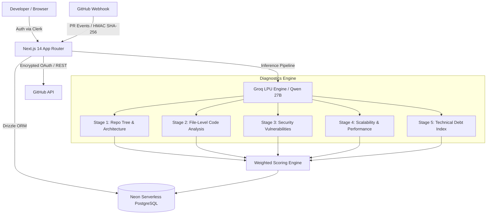

# RepoLens – AI-Powered Code Intelligence & 360° Repository Diagnostics

<div align="center">
  <p align="center">
    <strong>Instant, automated architectural audits, security vulnerability scans, technical debt indexing, and PR reviews.</strong>
  </p>
  <p align="center">
    <a href="#-key-features">Key Features</a> •
    <a href="#-architecture">Architecture</a> •
    <a href="#-getting-started">Getting Started</a> •
    <a href="#-environment-variables">Environment Setup</a> •
    <a href="#-deployment-guide">Deployment</a> •
    <a href="#-tech-stack">Tech Stack</a>
  </p>
</div>

---

## ⚡ Overview

**RepoLens** is a modern, production-grade code intelligence SaaS platform built for engineering teams. It continuously scans GitHub repositories with high-throughput LPU-accelerated AI models to identify architectural flaws, detect security vulnerabilities, calculate technical debt indexes, and post automated AI code reviews on GitHub Pull Requests.

---

## ✨ Key Features

- **5-Stage Comprehensive AI Diagnostics**:
  1. **Architecture Audit**: Analyzes folder hierarchy, separation of concerns, coupling metrics, and design pattern violations.
  2. **Security Vulnerability Scanner**: Identifies hardcoded secrets, injection vectors, XSS risks, and authentication bypasses with zero source code retention.
  3. **Scalability & Performance Review**: Pinpoints blocking synchronous calls, missing database indexes, N+1 query patterns, and memory leaks.
  4. **File-Level Code Smells**: Line-by-line inspection with automated refactor snippets and severity classifications.
  5. **Technical Debt Index**: Computes refactor priority matrices and team velocity debt burdens.
- **Ultra-Fast LPU Inference**: Powered by Groq inference (`qwen/qwen3.8-27b` and `openai/gpt-oss-120b`) delivering comprehensive repository scans in seconds.
- **Automated GitHub PR Bot**: Instant webhook-driven diff analysis that posts structured, actionable code review comments directly on pull requests.
- **Interactive Analytics Dashboard**: Health trajectories, radial score gauges, issue breakdowns, and historical trends powered by Recharts.
- **Multi-Format Export & Sharing**: Generate instant markdown audit reports and secure public shareable inspection links.
- **Enterprise-Grade Security**: AES-256-GCM token encryption, Clerk authentication, HMAC-verified GitHub webhooks, and zero-storage ephemeral memory analysis.

---

## 🏗 Architecture



---

## 🗄 Database Schema

Powered by **Drizzle ORM** and **Neon PostgreSQL**:

| Table | Purpose |
|---|---|
| `users` | User profiles, Clerk identity mapping, subscription tier (`free` / `pro`), and encrypted GitHub tokens |
| `repositories` | Connected repositories, metadata, default branches, and last scanned timestamps |
| `scans` | Diagnostic scan runs, stage progress, individual scores (0–100), summaries, and overall health |
| `file_reviews` | Per-file findings, line annotations, severity (`low`, `medium`, `high`, `critical`), and remediation code |
| `pull_request_reviews` | PR review diff records, risk assessments, breaking change probabilities, and comments |
| `usage_logs` | Audit trail of scans and token usage per user |

---

## 🚀 Getting Started

### 1. Prerequisites
- **Node.js**: v18.18+ or v20+
- **npm** / **pnpm** / **yarn**
- **Git**

### 2. Clone and Install Dependencies

```bash
git clone https://github.com/ShakilUrRehman21/RepoLens.git
cd RepoLens
npm install
```

### 3. Configure Environment Variables

Create a local environment file by copying `.env.example`:

```bash
cp .env.example .env.local
```

Fill in the required values (see [Environment Variables](#-environment-variables) below).

### 4. Initialize Database

Generate and push database migrations to Neon:

```bash
npx drizzle-kit push
```

### 5. Start Development Server

```bash
npm run dev
```

Open [http://localhost:3000](http://localhost:3000) in your browser.

---

## 🔐 Environment Variables

| Variable | Description | Source |
|---|---|---|
| `NEXT_PUBLIC_CLERK_PUBLISHABLE_KEY` | Clerk Frontend API key | [Clerk Dashboard](https://dashboard.clerk.com) |
| `CLERK_SECRET_KEY` | Clerk Backend Secret key | [Clerk Dashboard](https://dashboard.clerk.com) |
| `NEXT_PUBLIC_CLERK_SIGN_IN_URL` | Route for sign-in (`/sign-in`) | Default |
| `NEXT_PUBLIC_CLERK_SIGN_UP_URL` | Route for sign-up (`/sign-up`) | Default |
| `NEXT_PUBLIC_CLERK_AFTER_SIGN_IN_URL` | Redirect after auth (`/dashboard`) | Default |
| `NEXT_PUBLIC_CLERK_AFTER_SIGN_UP_URL` | Redirect after auth (`/dashboard`) | Default |
| `GITHUB_CLIENT_ID` | GitHub OAuth App Client ID | [GitHub Developer Settings](https://github.com/settings/developers) |
| `GITHUB_CLIENT_SECRET` | GitHub OAuth App Client Secret | [GitHub Developer Settings](https://github.com/settings/developers) |
| `GITHUB_WEBHOOK_SECRET` | HMAC Secret for GitHub Webhooks | Any random string |
| `GROQ_API_KEY` | Groq API Key for fast LPU inference | [Groq Console](https://console.groq.com) |
| `GROQ_MODEL` | Default model (`qwen/qwen3.8-27b`) | Groq supported model |
| `GEMINI_API_KEY` | Google Gemini API Key (optional fallback) | [Google AI Studio](https://aistudio.google.com) |
| `DATABASE_URL` | Connection string with SSL enabled | [Neon Console](https://neon.tech) |
| `ENCRYPTION_KEY` | 32-byte hex string for AES-256 token encryption | `node -e "console.log(require('crypto').randomBytes(32).toString('hex'))"` |
| `NEXT_PUBLIC_APP_URL` | Full URL of the application (`http://localhost:3000` or production domain) | Vercel domain |
| `ADMIN_USER_IDS` | Comma-separated list of Clerk User IDs with admin panel access | Clerk User ID (`user_...`) |

---

## 📦 Deployment Guide

### Deploying to Vercel (Recommended)

1. **Push your code to GitHub**:
   ```bash
   git add .
   git commit -m "chore: prepare for production release"
   git push origin master
   ```

2. **Import to Vercel**:
   - Go to [Vercel](https://vercel.com/new).
   - Select your `RepoLens` repository.
   - Framework Preset will automatically detect **Next.js**.

3. **Set Environment Variables**:
   - Copy each variable from your `.env.local` into Vercel Project Settings > **Environment Variables**.
   - Make sure to set `NEXT_PUBLIC_APP_URL` to your production domain (e.g., `https://repolens.vercel.app`).

4. **Update Clerk Configuration**:
   - In the [Clerk Dashboard](https://dashboard.clerk.com), navigate to **Paths** and **Domains**.
   - Add your Vercel production domain to allowed redirect URLs and origin domains.

5. **Configure GitHub OAuth & Webhooks (Optional for PR Bot)**:
   - In GitHub OAuth App settings, update the callback URL to:
     `https://<your-domain>/api/auth/callback/github` (or Clerk OAuth redirect URL).
   - In repository settings, add a Webhook pointing to:
     `https://<your-domain>/api/webhooks/github` with Content type `application/json` and Secret matching `GITHUB_WEBHOOK_SECRET`.

---

## 🛠 Tech Stack

- **Framework**: Next.js 14 (App Router, Server Components, Route Handlers)
- **Language**: TypeScript
- **Styling**: Vanilla Tailwind CSS, Lucide Icons, Radix UI Primitives
- **State & Data Visualization**: Recharts
- **Database & ORM**: PostgreSQL via Neon Serverless, Drizzle ORM
- **Authentication**: Clerk
- **AI Acceleration**: Groq SDK (`qwen/qwen3.8-27b`, `openai/gpt-oss-120b`, `openai/gpt-oss-20b`)
- **Git Integrations**: Octokit REST API, Webhooks
- **Security**: AES-256-GCM token encryption, zero source-code retention

---

## 📄 License

This project is licensed under the MIT License.
