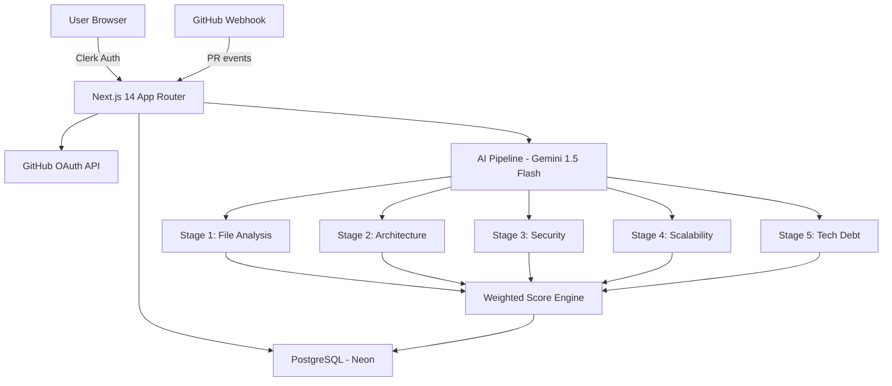

# GithubScanner – AI-Powered Code Intelligence Platform


## 🧠 Overview

GithubScanner is a production-grade SaaS tool that analyzes GitHub repositories using Google Gemini AI and delivers structured engineering insights: architecture scores, security audits, technical debt indexes, scalability evaluations, and automated PR reviews.

---

## 🏗 Architecture



---

## 🗄 Database Schema

| Table | Description |
|---|---|
| `users` | Clerk user, plan (free/pro), encrypted GitHub token |
| `repositories` | Imported GitHub repos per user |
| `scans` | Full scan with all 5 category scores + overall score |
| `file_reviews` | Per-file issues, score, risk level (JSON) |
| `pull_request_reviews` | PR risk score, breaking change probability, AI comment |
| `usage_logs` | Token usage tracking per user per scan |

---

## 🤖 AI Pipeline (5 Stages)

| Stage | Description | Output |
|---|---|---|
| 1. File Analysis | Code smells, naming, complexity | file_score, issues[] |
| 2. Architecture | MVC/monolith detection, coupling | architecture_score |
| 3. Security | Secrets, XSS, SQLi, auth flaws | security_score |
| 4. Scalability | Async issues, DB indexing, caching | scalability_score, performance_score |
| 5. Technical Debt | High-risk files, refactor priority | technical_debt_index |

**Weighted Scoring:** Architecture 25% + Security 25% + Maintainability 20% + Scalability 15% + Performance 15%

All AI responses are forced to return **structured JSON only** via `responseMimeType: 'application/json'`.

---

## 🚀 Getting Started

### 1. Clone & Install

```bash
git clone https://github.com/your-username/githubscanner
cd githubscanner
npm install
```

### 2. Set Up Environment Variables

```bash
cp .env.local.example .env.local
# Fill in all values (see table below)
```

### 3. Run Database Migrations

```bash
npx drizzle-kit generate
npx drizzle-kit migrate
```

### 4. Start Dev Server

```bash
npm run dev
# Open http://localhost:3000
```

---

## 🔐 Environment Variables

| Variable | Description | Where to Get |
|---|---|---|
| `NEXT_PUBLIC_CLERK_PUBLISHABLE_KEY` | Clerk public key | [clerk.com](https://clerk.com) |
| `CLERK_SECRET_KEY` | Clerk secret key | clerk.com |
| `GITHUB_CLIENT_ID` | GitHub OAuth App client ID | GitHub Settings → Developer |
| `GITHUB_CLIENT_SECRET` | GitHub OAuth App secret | GitHub Settings → Developer |
| `GITHUB_WEBHOOK_SECRET` | Webhook HMAC secret | Generate randomly |
| `GEMINI_API_KEY` | Google Gemini API key | [aistudio.google.com](https://aistudio.google.com) |
| `DATABASE_URL` | PostgreSQL connection string | [neon.tech](https://neon.tech) |
| `ENCRYPTION_KEY` | 32-byte hex key for token encryption | `node -e "console.log(require('crypto').randomBytes(32).toString('hex'))"` |
| `NEXT_PUBLIC_APP_URL` | Your app's public URL | Your domain / localhost:3000 |
| `ADMIN_USER_IDS` | Comma-separated Clerk user IDs with admin access | Your Clerk user ID |

---

## 📦 Deploy to Vercel

```bash
vercel deploy
```

Set all environment variables in your Vercel project dashboard.

For PR automation via GitHub webhooks, set your webhook URL to:
```
https://your-app.vercel.app/api/webhooks/github
```

---

## 🎨 Tech Stack

- **Frontend:** Next.js 14 App Router, TypeScript, Tailwind CSS, ShadCN UI, Recharts
- **Backend:** Next.js API Routes, Drizzle ORM, Neon PostgreSQL
- **Auth:** Clerk (Google + GitHub OAuth)
- **AI:** Google Gemini 1.5 Flash (structured JSON output)
- **Security:** AES-256-GCM token encryption, HMAC webhook verification

---

## 📋 Features

- ✅ 5-stage AI analysis pipeline
- ✅ Architecture, security, scalability, maintainability, performance scoring
- ✅ File-level issues with refactor suggestions
- ✅ Technical debt index + refactor priority
- ✅ PR automation (webhook + AI review + auto-comment)
- ✅ Recharts analytics dashboard (radial, line, area charts)
- ✅ Interactive file tree explorer
- ✅ Scan history + trend charts
- ✅ Markdown report export
- ✅ Public share links
- ✅ Admin dashboard (users, scans, token usage, ban)
- ✅ Rate limiting (free: 3 scans/day)
- ✅ Encrypted GitHub token storage
